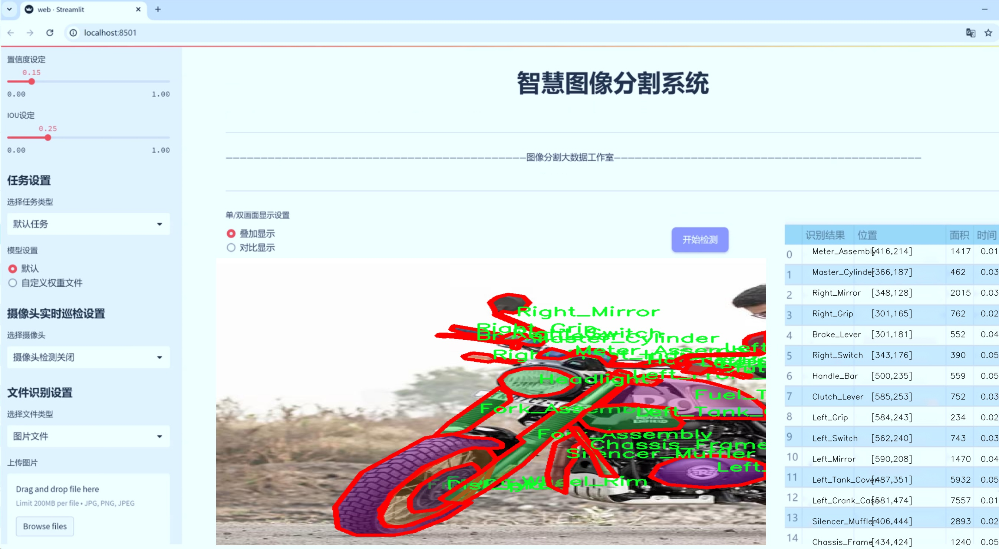
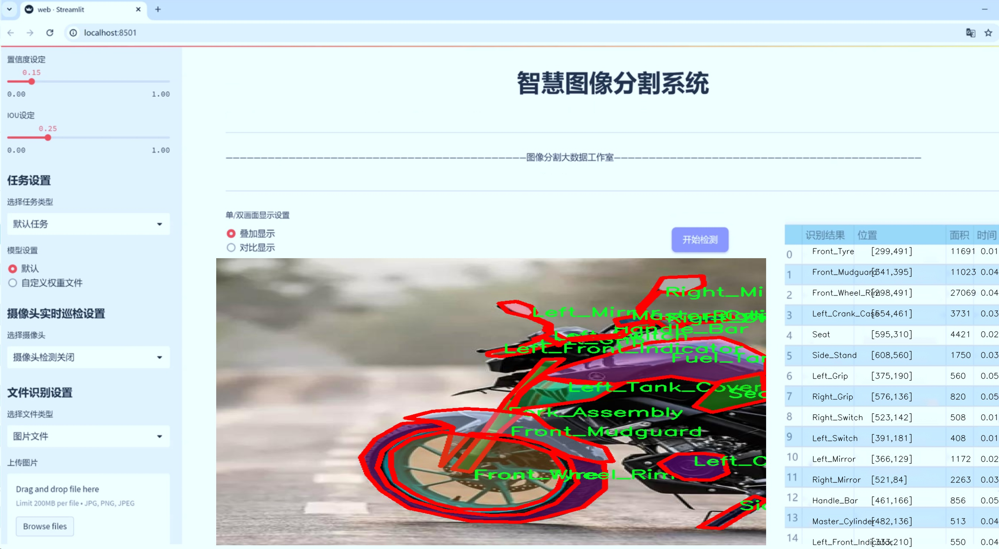
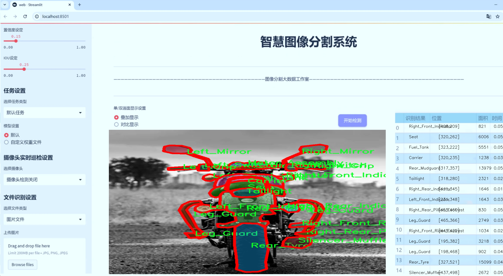
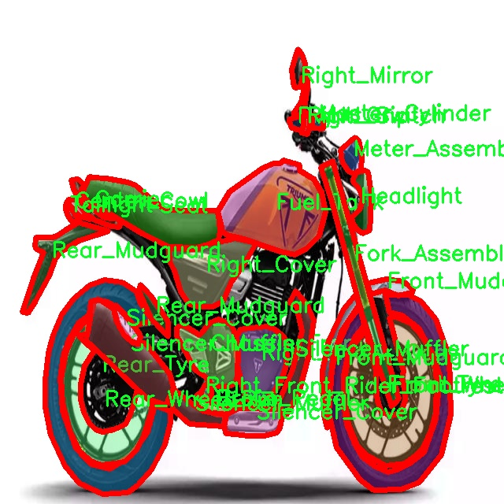
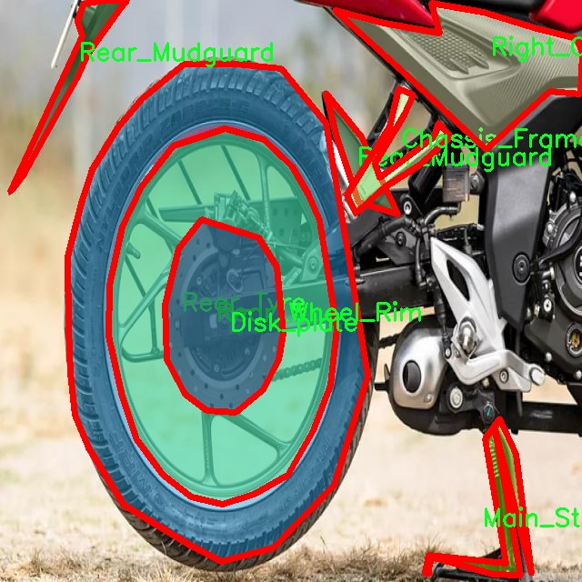
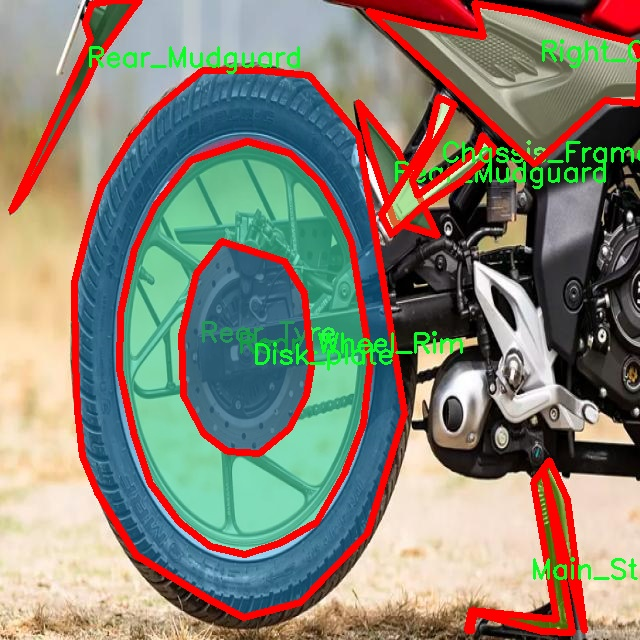
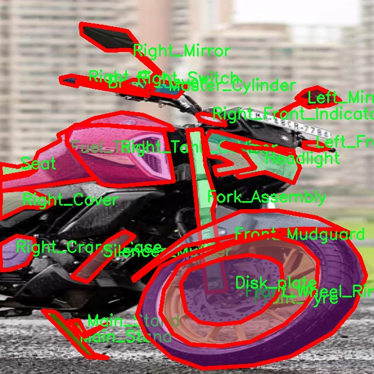

# 摩托车零部件分割系统源码＆数据集分享
 [yolov8-seg-C2f-EMBC＆yolov8-seg-act等50+全套改进创新点发刊_一键训练教程_Web前端展示]

### 1.研究背景与意义

项目参考[ILSVRC ImageNet Large Scale Visual Recognition Challenge](https://gitee.com/YOLOv8_YOLOv11_Segmentation_Studio/projects)

项目来源[AAAI Global Al lnnovation Contest](https://kdocs.cn/l/cszuIiCKVNis)

研究背景与意义

随着摩托车在全球范围内的普及，摩托车零部件的管理与维护显得尤为重要。摩托车不仅是交通工具，更是许多消费者的生活方式和文化象征。为了提高摩托车的安全性和性能，及时、准确地对其零部件进行识别和分割具有重要的现实意义。传统的摩托车零部件检测方法往往依赖于人工识别和经验判断，这不仅效率低下，而且容易受到人为因素的影响，导致识别错误和维护不当。因此，开发一种基于深度学习的自动化摩托车零部件分割系统显得尤为迫切。

近年来，深度学习技术的迅猛发展为图像处理领域带来了革命性的变化。YOLO（You Only Look Once）系列模型因其高效的实时目标检测能力而广受欢迎。YOLOv8作为该系列的最新版本，进一步提升了检测精度和速度，尤其在复杂背景下的物体识别方面表现出色。然而，针对摩托车零部件的实例分割任务，YOLOv8仍然存在一定的局限性。为了更好地适应摩托车零部件的多样性和复杂性，改进YOLOv8以实现更高效的分割效果显得尤为重要。

本研究将基于“Fusion-Bike-Parts”数据集，构建一个改进的YOLOv8摩托车零部件分割系统。该数据集包含6700张图像，涵盖57种摩托车零部件类别，如刹车杆、油箱、车架等。这些丰富的样本为模型的训练提供了坚实的基础，使其能够在多样化的场景中进行有效的分割。通过对这些零部件进行精确的实例分割，不仅可以提高摩托车的维护效率，还能为后续的智能化管理提供数据支持。

此外，摩托车零部件的准确识别与分割对零部件的库存管理、供应链优化以及售后服务等方面都有着深远的影响。通过建立高效的分割系统，企业可以更好地掌握零部件的使用情况和需求变化，从而实现精细化管理，降低运营成本。同时，消费者也能通过该系统获得更为精准的零部件信息，提升使用体验。

总之，基于改进YOLOv8的摩托车零部件分割系统不仅具有重要的学术价值，更具备广泛的应用前景。它将推动摩托车行业向智能化、自动化的方向发展，为行业的可持续发展提供新的动力。通过本研究的开展，我们希望能够为摩托车零部件的智能识别与管理提供有效的解决方案，为行业的技术进步贡献一份力量。

### 2.图片演示







##### 注意：由于此博客编辑较早，上面“2.图片演示”和“3.视频演示”展示的系统图片或者视频可能为老版本，新版本在老版本的基础上升级如下：（实际效果以升级的新版本为准）

  （1）适配了YOLOV8的“目标检测”模型和“实例分割”模型，通过加载相应的权重（.pt）文件即可自适应加载模型。

  （2）支持“图片识别”、“视频识别”、“摄像头实时识别”三种识别模式。

  （3）支持“图片识别”、“视频识别”、“摄像头实时识别”三种识别结果保存导出，解决手动导出（容易卡顿出现爆内存）存在的问题，识别完自动保存结果并导出到tempDir中。

  （4）支持Web前端系统中的标题、背景图等自定义修改，后面提供修改教程。

  另外本项目提供训练的数据集和训练教程,暂不提供权重文件（best.pt）,需要您按照教程进行训练后实现图片演示和Web前端界面演示的效果。

### 3.视频演示

[3.1 视频演示](https://www.bilibili.com/video/BV1SY28YREW6/)

### 4.数据集信息展示

##### 4.1 本项目数据集详细数据（类别数＆类别名）

nc: 57
names: ['Brake_Lever', 'Brake_Pedal', 'Carrier', 'Center_Cowl', 'Chain_Cover', 'Chassis_Frame', 'Clutch_Lever', 'Disk_plate', 'Fork_Assembly', 'Front_Mudguard', 'Front_Tyre', 'Front_Wheel_Rim', 'Fuel_Tank', 'Gear_Shifter', 'Handle_Bar', 'Headlight', 'Left_Cover', 'Left_Cowl', 'Left_Crank_Case', 'Left_Front_Indicator', 'Left_Front_Rider_Footrest', 'Left_Grip', 'Left_Mirror', 'Left_Rear_Indicator', 'Left_Rear_Pillion_Footrest', 'Left_Switch', 'Left_Tank_Cover', 'Leg_Guard', 'Lock_Set', 'Main_Stand', 'Master_Cylinder', 'Meter_Assembly', 'Rear_Mudguard', 'Rear_Shocker', 'Rear_Tyre', 'Rear_Wheel_Rim', 'Right_Cover', 'Right_Cowl', 'Right_Crank_Case', 'Right_Front_Indicator', 'Right_Front_Rider_Footrest', 'Right_Grip', 'Right_Mirror', 'Right_Rear_Indicator', 'Right_Rear_Pillion_Footrest', 'Right_Switch', 'Right_Tank_Cover', 'Saree_Guard', 'Seat', 'Side_Stand', 'Silencer_Cover', 'Silencer_Muffler', 'Swing_Arm', 'Taillight', 'Tool_Box', 'Visor', 'Windscreen']


##### 4.2 本项目数据集信息介绍

数据集信息展示

在本研究中，我们使用了名为“Fusion-Bike-Parts”的数据集，以训练和改进YOLOv8-seg模型，旨在实现摩托车零部件的高效分割。该数据集包含57个类别，涵盖了摩托车的各个重要组成部分，提供了丰富的样本和多样化的标注信息，确保了模型训练的全面性和有效性。

“Fusion-Bike-Parts”数据集的类别列表极为详尽，涵盖了从摩托车的基本结构到细节组件的各个方面。这些类别包括但不限于制动系统的“Brake_Lever”和“Brake_Pedal”，承载部件的“Carrier”，以及车身外壳的“Center_Cowl”和“Chain_Cover”。此外，数据集中还包含了“Chassis_Frame”、“Fork_Assembly”、“Fuel_Tank”等关键部件，这些都是摩托车正常运作所必需的基础构件。

在前端组件方面，数据集提供了“Headlight”、“Front_Mudguard”、“Front_Tyre”和“Front_Wheel_Rim”等类别，确保了模型能够识别和分割摩托车的前部结构。而在后端组件中，“Rear_Mudguard”、“Rear_Tyre”和“Rear_Wheel_Rim”等类别则同样不可或缺，这些部件的精确分割对于后续的维护和修理工作至关重要。

此外，数据集还包含了多个细节部件，例如“Gear_Shifter”、“Handle_Bar”、“Master_Cylinder”等，这些部件虽然在整体结构中可能不显眼，但它们的功能性和重要性却不可小觑。通过对这些细节的精准分割，模型将能够为摩托车的维护和零部件更换提供更为直观和高效的支持。

值得注意的是，数据集中还包括了多个配件和装饰部件，如“Visor”、“Windscreen”、“Taillight”等，这些元素不仅提升了摩托车的美观性，也在一定程度上影响了其性能表现。通过对这些部件的分割，模型能够为用户提供更为全面的摩托车部件识别服务。

“Fusion-Bike-Parts”数据集的设计充分考虑了摩托车零部件的多样性和复杂性，确保了每个类别都有足够的样本量以支持深度学习模型的训练。这种多样性不仅提高了模型的泛化能力，也为实际应用提供了更为可靠的基础。

总之，“Fusion-Bike-Parts”数据集以其丰富的类别和详尽的标注，为改进YOLOv8-seg的摩托车零部件分割系统提供了坚实的基础。通过对这些零部件的精确分割，研究者们能够更好地理解摩托车的结构特征，从而推动相关技术的发展与应用。该数据集的应用不仅有助于提高摩托车的维护效率，也为后续的智能化发展奠定了基础。










### 5.全套项目环境部署视频教程（零基础手把手教学）

[5.1 环境部署教程链接（零基础手把手教学）](https://www.bilibili.com/video/BV1jG4Ve4E9t/?vd_source=bc9aec86d164b67a7004b996143742dc)


[5.2 安装Python虚拟环境创建和依赖库安装视频教程链接（零基础手把手教学）](https://www.bilibili.com/video/BV1nA4VeYEze/?vd_source=bc9aec86d164b67a7004b996143742dc)

### 6.手把手YOLOV8-seg训练视频教程（零基础小白有手就能学会）

[6.1 手把手YOLOV8-seg训练视频教程（零基础小白有手就能学会）](https://www.bilibili.com/video/BV1cA4VeYETe/?vd_source=bc9aec86d164b67a7004b996143742dc)


按照上面的训练视频教程链接加载项目提供的数据集，运行train.py即可开始训练



     Epoch   gpu_mem       box       obj       cls    labels  img_size
     1/200     0G   0.01576   0.01955  0.007536        22      1280: 100%|██████████| 849/849 [14:42<00:00,  1.04s/it]
               Class     Images     Labels          P          R     mAP@.5 mAP@.5:.95: 100%|██████████| 213/213 [01:14<00:00,  2.87it/s]
                 all       3395      17314      0.994      0.957      0.0957      0.0843

     Epoch   gpu_mem       box       obj       cls    labels  img_size
     2/200     0G   0.01578   0.01923  0.007006        22      1280: 100%|██████████| 849/849 [14:44<00:00,  1.04s/it]
               Class     Images     Labels          P          R     mAP@.5 mAP@.5:.95: 100%|██████████| 213/213 [01:12<00:00,  2.95it/s]
                 all       3395      17314      0.996      0.956      0.0957      0.0845

     Epoch   gpu_mem       box       obj       cls    labels  img_size
     3/200     0G   0.01561    0.0191  0.006895        27      1280: 100%|██████████| 849/849 [10:56<00:00,  1.29it/s]
               Class     Images     Labels          P          R     mAP@.5 mAP@.5:.95: 100%|███████   | 187/213 [00:52<00:00,  4.04it/s]
                 all       3395      17314      0.996      0.957      0.0957      0.0845


### 7.50+种全套YOLOV8-seg创新点代码加载调参视频教程（一键加载写好的改进模型的配置文件）

[7.1 50+种全套YOLOV8-seg创新点代码加载调参视频教程（一键加载写好的改进模型的配置文件）](https://www.bilibili.com/video/BV1Hw4VePEXv/?vd_source=bc9aec86d164b67a7004b996143742dc)

### 8.YOLOV8-seg图像分割算法原理

原始YOLOv8-seg算法原理

YOLOv8-seg算法是YOLO系列目标检测算法的最新进展，专注于目标检测与分割任务的结合。作为一种单阶段检测算法，YOLOv8-seg在精度和速度上都实现了显著的优化，成为计算机视觉领域中一个极具竞争力的解决方案。该算法的核心在于其独特的网络结构设计，主要由输入层、Backbone骨干网络、Neck特征融合网络和Head检测模块四个部分组成。每个部分在整个模型中扮演着至关重要的角色，协同工作以实现高效的目标检测和分割。

在输入层，YOLOv8-seg首先对输入图像进行预处理，包括调整图像比例、实现Mosaic增强和瞄点计算等。这些预处理步骤旨在提升模型对不同场景和条件下图像的适应能力，使得后续的特征提取和检测过程更加高效。Mosaic增强技术通过将多张图像拼接在一起，生成新的训练样本，从而增加了数据的多样性，有助于提高模型的泛化能力。

Backbone部分是YOLOv8-seg的特征提取模块，采用了经过优化的DarkNet结构。与之前的YOLO版本不同，YOLOv8引入了C2f模块替代了传统的C3模块，这一变化旨在增强网络的梯度流动信息，同时保持轻量级特性。C2f模块通过调整通道数，能够更好地捕捉不同尺度的特征信息，提升特征提取的效率。此外，YOLOv8还通过SPPF模块对输出特征图进行处理，利用不同内核尺寸的池化操作合并特征图，从而为后续的特征融合提供了丰富的基础。

在Neck部分，YOLOv8-seg采用了“双塔结构”，结合了特征金字塔网络（FPN）和路径聚合网络（PAN）。这一设计促进了语义特征和定位特征的有效转移，增强了网络对不同尺度目标的检测能力。特征金字塔网络通过多尺度特征的融合，确保了网络能够同时关注到大目标和小目标的特征信息，而路径聚合网络则通过优化特征传递路径，进一步提升了特征融合的效果。这种多层次、多尺度的特征处理方式，使得YOLOv8-seg在复杂场景下的目标检测和分割表现得更加出色。

在Head检测模块中，YOLOv8-seg采用了解耦头的结构，将回归分支和预测分支进行分离。这一设计的主要目的是使得模型在处理目标检测和分割任务时，能够更加专注于各自的任务，从而提高定位精度和分类准确性。解耦头的引入有效地解决了复杂场景下可能出现的定位不准和分类错误的问题，进一步提升了模型的整体性能。

值得一提的是，YOLOv8-seg在目标检测中采用了Anchor-free的方法。这种方法通过直接回归目标的位置和大小，避免了传统方法中预先定义锚点框的繁琐过程。Anchor-free的设计使得模型能够更快地聚焦于目标位置的邻近点，从而使得预测框更接近于实际的边界框区域。这一创新的设计理念，不仅提升了模型的检测速度，也增强了其在不同尺度和形状目标处理上的灵活性。

YOLOv8-seg的轻量化特性使其能够在各种嵌入式设备上高效运行，满足实时检测的需求。通过对骨干特征提取网络的优化，YOLOv8-seg在保持高精度的同时，显著降低了模型的计算复杂度。这一特性使得YOLOv8-seg不仅适用于传统的计算机视觉任务，也为智能监控、自动驾驶等实时应用场景提供了强有力的支持。

总的来说，YOLOv8-seg算法通过其创新的网络结构设计和高效的特征处理机制，实现了目标检测与分割任务的有效结合。其在处理复杂场景和多尺度目标时展现出的优越性能，使其成为计算机视觉领域中的一项重要技术进展。随着YOLOv8-seg的不断发展和优化，未来在智能视觉应用中的潜力将更加广阔。


### 9.系统功能展示（检测对象为举例，实际内容以本项目数据集为准）

图9.1.系统支持检测结果表格显示

  图9.2.系统支持置信度和IOU阈值手动调节

  图9.3.系统支持自定义加载权重文件best.pt(需要你通过步骤5中训练获得)

  图9.4.系统支持摄像头实时识别

  图9.5.系统支持图片识别

  图9.6.系统支持视频识别

  图9.7.系统支持识别结果文件自动保存

  图9.8.系统支持Excel导出检测结果数据


### 10.50+种全套YOLOV8-seg创新点原理讲解（非科班也可以轻松写刊发刊，V11版本正在科研待更新）

#### 10.1 由于篇幅限制，每个创新点的具体原理讲解就不一一展开，具体见下列网址中的创新点对应子项目的技术原理博客网址【Blog】：


[10.1 50+种全套YOLOV8-seg创新点原理讲解链接](https://gitee.com/qunmasj/good)

#### 10.2 部分改进模块原理讲解(完整的改进原理见上图和技术博客链接)【如果此小节的图加载失败可以通过CSDN或者Github搜索该博客的标题访问原始博客，原始博客图片显示正常】
### 全维动态卷积ODConv
鉴于上述讨论，我们的ODConv引入了一种多维注意机制，该机制具有并行策略，用于学习卷积核在核空间的所有四个维度上的不同注意。图提供了CondConv、DyConv和ODConv的示意性比较。

ODConv的公式：根据等式1中的符号，ODConv可定义为


 将注意力标量分配给整个卷积核。图2示出了将这四种类型的关注乘以n个卷积核的过程。原则上，这四种类型的关注是相互补充的，并且以位置、信道、滤波器和核的顺序将它们逐步乘以卷积核 
 ，使得卷积运算不同w.r.t.所有空间位置、所有输入信道、所有滤波器和输入x的所有核，提供捕获丰富上下文线索的性能保证。因此，ODConv可以显著增强CNN基本卷积运算的特征提取能力。此外，具有单个卷积核的ODConv可以与标准CondConv和DyConv竞争或优于它们，为最终模型引入的额外参数大大减少。提供了大量实验来验证这些优点。通过比较等式1和等式2，我们可以清楚地看到，ODConv是一种更广义的动态卷积。此外，当设置n=1且 所有分量均为1时，只关注滤波器方向 的ODConv将减少为：将基于输入特征的SE变量应用于卷积滤波器，然后进行卷积运算（注意原始SE（Hu等人，2018b）基于输出特征，并且用于重新校准输出特征本身）。这种SE变体是ODConv的特例。


图：将ODConv中的四种注意类型逐步乘以卷积核的示例。（a） 沿空间维度的逐位置乘法运算，（b）沿输入信道维度的逐信道乘法运算、（c）沿输出信道维度的按滤波器乘法运算，以及（d）沿卷积核空间的核维度的按核乘法运算。方法部分对符号进行了说明
实现：对于ODConv，一个关键问题是如何计算卷积核的四种关注度 。继CondConv和DyConv之后，我们还使用SE型注意力模块（Hu等人，2018b），但将多个头部作为来计算它们，其结构如图所示。具体而言，首先通过逐通道全局平均池（GAP）运算将输入压缩到具有长度的特征向量中。随后，存在完全连接（FC）层和四个头部分支。ReLU（Krizhevsky等人，2012）位于FC层之后。FC层将压缩特征向量映射到具有缩减比的低维空间（根据消融实验，我们在所有主要实验中设置 ，避免了高模型复杂度）。对于四个头部分支，每个分支都有一个输出大小如图。

### 引入ODConv的改进YOLO
参考这篇博客涵盖了引入ODConv的改进YOLOv8系统的内容，ODConv采用多维注意机制，在卷积核空间的四个维度上学习不同的注意。结合了CondConv和DyConv的优势，ODConv通过图示的四种注意类型逐步与卷积核相乘，以捕获丰富的上下文线索，提升特征提取能力。

#### ODConv结构与方法
ODConv的公式和图示展示了其关注力分配给卷积核的方式，其中四种类型的关注以位置、信道、滤波器和核的顺序逐步与卷积核相乘。这种结构保证了卷积运算不同于标准的Conv操作，能够捕获更多上下文信息，从而增强了CNN的特征提取能力。另外，单个卷积核的ODConv在性能上能够与CondConv和DyConv相竞争，并且引入的额外参数大幅减少。

ODConv的特殊之处在于其广义的动态卷积性质，同时在特定条件下（n=1且所有分量为1），它可以退化为一种特例，即只关注滤波器方向，这类似于基于输入特征的SE变体，但不同于原始SE，它基于输出特征。

#### ODConv的实现
关键问题在于如何计算卷积核的四种关注度。ODConv采用了SE型注意力模块，结合了多个头部来计算这些关注度。具体实现上，通过逐通道全局平均池运算和完全连接层，将输入压缩为特征向量，随后使用四个头部分支来计算四种不同类型的关注。这样的结构能在保持模型复杂度可控的情况下，提升了特征的表征能力。

ODConv的引入为YOLOv8带来了显著的性能提升，并且通过大量实验证明了其在特征提取方面的优越性。其结合了多维注意机制和卷积操作，为目标检测和分拣系统的提升带来了新的思路和性能突破。


### 11.项目核心源码讲解（再也不用担心看不懂代码逻辑）

#### 11.1 ui.py

以下是经过简化和注释的核心代码部分：

```python
import sys
import subprocess
from QtFusion.path import abs_path

def run_script(script_path):
    """
    使用当前 Python 环境运行指定的脚本。

    Args:
        script_path (str): 要运行的脚本路径
    """
    # 获取当前 Python 解释器的路径
    python_path = sys.executable

    # 构建运行命令，使用 streamlit 运行指定的脚本
    command = f'"{python_path}" -m streamlit run "{script_path}"'

    # 执行命令，并检查返回结果
    result = subprocess.run(command, shell=True)
    if result.returncode != 0:
        print("脚本运行出错。")

# 主程序入口
if __name__ == "__main__":
    # 获取脚本的绝对路径
    script_path = abs_path("web.py")

    # 运行指定的脚本
    run_script(script_path)
```

### 代码注释说明：

1. **导入模块**：
   - `sys`：用于访问与 Python 解释器相关的变量和函数。
   - `subprocess`：用于创建新进程、连接到它们的输入/输出/错误管道，并获取返回码。
   - `abs_path`：从 `QtFusion.path` 导入的函数，用于获取文件的绝对路径。

2. **`run_script` 函数**：
   - 该函数接受一个脚本路径作为参数，并使用当前 Python 环境运行该脚本。
   - 使用 `sys.executable` 获取当前 Python 解释器的路径。
   - 构建一个命令字符串，使用 `streamlit` 模块运行指定的脚本。
   - 使用 `subprocess.run` 执行命令，并检查返回码以确定脚本是否成功运行。

3. **主程序入口**：
   - 通过 `if __name__ == "__main__":` 确保只有在直接运行该脚本时才会执行以下代码。
   - 使用 `abs_path` 获取 `web.py` 脚本的绝对路径。
   - 调用 `run_script` 函数运行该脚本。

这个程序文件名为 `ui.py`，它的主要功能是运行一个指定的 Python 脚本，具体来说是使用 Streamlit 框架来启动一个 Web 应用。

首先，文件中导入了一些必要的模块，包括 `sys`、`os` 和 `subprocess`。其中，`sys` 模块用于访问与 Python 解释器相关的变量和函数，`os` 模块提供了与操作系统交互的功能，而 `subprocess` 模块则用于执行外部命令。

接下来，文件中定义了一个名为 `run_script` 的函数。这个函数接受一个参数 `script_path`，它是要运行的脚本的路径。函数内部首先获取当前 Python 解释器的路径，这通过 `sys.executable` 实现。然后，构建一个命令字符串，命令的格式是使用当前 Python 解释器来运行 Streamlit，并指定要运行的脚本路径。接着，使用 `subprocess.run` 方法执行这个命令。如果脚本运行的返回码不为 0，表示运行过程中出现了错误，程序会打印出“脚本运行出错”的提示。

在文件的最后部分，使用了一个常见的 Python 习惯，即 `if __name__ == "__main__":`，这意味着只有当这个文件被直接运行时，以下代码才会执行。在这里，指定了要运行的脚本路径为 `web.py`，这个路径是通过 `abs_path` 函数获取的，确保获取的是脚本的绝对路径。最后，调用 `run_script` 函数来运行指定的脚本。

总体来看，这个程序的主要作用是提供一个简单的接口来启动一个 Streamlit Web 应用，便于用户通过命令行来运行指定的 Python 脚本。

#### 11.2 ultralytics\nn\extra_modules\rep_block.py

以下是代码中最核心的部分，并附上详细的中文注释：

```python
import torch
import torch.nn as nn
import torch.nn.functional as F

# 定义一个用于融合卷积和批归一化的函数
def transI_fusebn(kernel, bn):
    # 获取批归一化的权重和标准差
    gamma = bn.weight
    std = (bn.running_var + bn.eps).sqrt()
    # 返回融合后的卷积核和偏置
    return kernel * ((gamma / std).reshape(-1, 1, 1, 1)), bn.bias - bn.running_mean * gamma / std

# 定义一个用于将多个卷积核和偏置相加的函数
def transII_addbranch(kernels, biases):
    return sum(kernels), sum(biases

# 定义一个用于处理1x1卷积和kxk卷积的函数
def transIII_1x1_kxk(k1, b1, k2, b2, groups):
    if groups == 1:
        # 如果是单组卷积，直接进行卷积操作
        k = F.conv2d(k2, k1.permute(1, 0, 2, 3))
        b_hat = (k2 * b1.reshape(1, -1, 1, 1)).sum((1, 2, 3))
    else:
        # 如果是多组卷积，分别处理每一组
        k_slices = []
        b_slices = []
        k1_T = k1.permute(1, 0, 2, 3)
        k1_group_width = k1.size(0) // groups
        k2_group_width = k2.size(0) // groups
        for g in range(groups):
            k1_T_slice = k1_T[:, g*k1_group_width:(g+1)*k1_group_width, :, :]
            k2_slice = k2[g*k2_group_width:(g+1)*k2_group_width, :, :, :]
            k_slices.append(F.conv2d(k2_slice, k1_T_slice))
            b_slices.append((k2_slice * b1[g*k1_group_width:(g+1)*k1_group_width].reshape(1, -1, 1, 1)).sum((1, 2, 3)))
        k, b_hat = transIV_depthconcat(k_slices, b_slices)
    return k, b_hat + b2

# 定义一个用于将多个卷积核和偏置在深度维度上连接的函数
def transIV_depthconcat(kernels, biases):
    return torch.cat(kernels, dim=0), torch.cat(biases)

# 定义一个用于生成平均池化卷积核的函数
def transV_avg(channels, kernel_size, groups):
    input_dim = channels // groups
    k = torch.zeros((channels, input_dim, kernel_size, kernel_size))
    k[np.arange(channels), np.tile(np.arange(input_dim), groups), :, :] = 1.0 / kernel_size ** 2
    return k

# 定义一个卷积层和批归一化层的组合
def conv_bn(in_channels, out_channels, kernel_size, stride=1, padding=0, dilation=1, groups=1,
                   padding_mode='zeros'):
    conv_layer = nn.Conv2d(in_channels=in_channels, out_channels=out_channels, kernel_size=kernel_size,
                           stride=stride, padding=padding, dilation=dilation, groups=groups,
                           bias=False, padding_mode=padding_mode)
    bn_layer = nn.BatchNorm2d(num_features=out_channels, affine=True)
    se = nn.Sequential()
    se.add_module('conv', conv_layer)
    se.add_module('bn', bn_layer)
    return se

# 定义一个多分支块的类
class DiverseBranchBlock(nn.Module):
    def __init__(self, in_channels, out_channels, kernel_size,
                 stride=1, padding=None, dilation=1, groups=1,
                 internal_channels_1x1_3x3=None,
                 deploy=False, single_init=False):
        super(DiverseBranchBlock, self).__init__()
        self.deploy = deploy
        self.kernel_size = kernel_size
        self.out_channels = out_channels
        self.groups = groups
        
        # 计算填充
        if padding is None:
            padding = kernel_size // 2
        assert padding == kernel_size // 2

        if deploy:
            # 部署模式下，直接使用卷积层
            self.dbb_reparam = nn.Conv2d(in_channels=in_channels, out_channels=out_channels, kernel_size=kernel_size, stride=stride,
                                      padding=padding, dilation=dilation, groups=groups, bias=True)
        else:
            # 非部署模式下，构建多个分支
            self.dbb_origin = conv_bn(in_channels=in_channels, out_channels=out_channels, kernel_size=kernel_size, stride=stride, padding=padding, dilation=dilation, groups=groups)

            # 平均池化分支
            self.dbb_avg = nn.Sequential()
            if groups < out_channels:
                self.dbb_avg.add_module('conv',
                                        nn.Conv2d(in_channels=in_channels, out_channels=out_channels, kernel_size=1,
                                                  stride=1, padding=0, groups=groups, bias=False))
                self.dbb_avg.add_module('bn', nn.BatchNorm2d(out_channels))
                self.dbb_avg.add_module('avg', nn.AvgPool2d(kernel_size=kernel_size, stride=stride, padding=0))
                self.dbb_1x1 = conv_bn(in_channels=in_channels, out_channels=out_channels, kernel_size=1, stride=stride,
                                       padding=0, groups=groups)
            else:
                self.dbb_avg.add_module('avg', nn.AvgPool2d(kernel_size=kernel_size, stride=stride, padding=padding))

            self.dbb_avg.add_module('avgbn', nn.BatchNorm2d(out_channels))

            # 1x1和kxk卷积的组合
            if internal_channels_1x1_3x3 is None:
                internal_channels_1x1_3x3 = in_channels if groups < out_channels else 2 * in_channels

            self.dbb_1x1_kxk = nn.Sequential()
            if internal_channels_1x1_3x3 == in_channels:
                self.dbb_1x1_kxk.add_module('idconv1', IdentityBasedConv1x1(channels=in_channels, groups=groups))
            else:
                self.dbb_1x1_kxk.add_module('conv1', nn.Conv2d(in_channels=in_channels, out_channels=internal_channels_1x1_3x3,
                                                            kernel_size=1, stride=1, padding=0, groups=groups, bias=False))
            self.dbb_1x1_kxk.add_module('bn1', nn.BatchNorm2d(internal_channels_1x1_3x3))
            self.dbb_1x1_kxk.add_module('conv2', nn.Conv2d(in_channels=internal_channels_1x1_3x3, out_channels=out_channels,
                                                            kernel_size=kernel_size, stride=stride, padding=0, groups=groups, bias=False))
            self.dbb_1x1_kxk.add_module('bn2', nn.BatchNorm2d(out_channels))

    # 前向传播
    def forward(self, inputs):
        if hasattr(self, 'dbb_reparam'):
            return self.dbb_reparam(inputs)

        out = self.dbb_origin(inputs)
        if hasattr(self, 'dbb_1x1'):
            out += self.dbb_1x1(inputs)
        out += self.dbb_avg(inputs)
        out += self.dbb_1x1_kxk(inputs)
        return out
```

### 代码说明：
1. **transI_fusebn**: 该函数用于将卷积层的权重与批归一化层的参数融合，返回融合后的卷积核和偏置。
2. **transII_addbranch**: 该函数用于将多个卷积核和偏置相加，返回相加后的结果。
3. **transIII_1x1_kxk**: 该函数处理1x1卷积和kxk卷积的组合，支持多组卷积。
4. **transIV_depthconcat**: 该函数用于在深度维度上连接多个卷积核和偏置。
5. **transV_avg**: 该函数生成平均池化的卷积核。
6. **conv_bn**: 该函数构建一个卷积层和批归一化层的组合。
7. **DiverseBranchBlock**: 该类实现了一个多分支卷积块，支持不同的卷积结构和操作。包含前向传播方法，处理输入数据并返回输出。

这个程序文件定义了一个名为 `DiverseBranchBlock` 的神经网络模块，主要用于构建深度学习模型中的卷积层。文件中包含了一些辅助函数和类，用于处理卷积操作、批归一化以及其他相关功能。

首先，文件导入了必要的库，包括 PyTorch 的核心库和一些自定义的卷积模块。接着，定义了一些转换函数，这些函数用于在卷积和批归一化之间进行转换和融合，以便在不同的网络结构中使用。

`transI_fusebn` 函数用于将卷积层的权重与批归一化层的参数融合，返回融合后的卷积核和偏置。`transII_addbranch` 函数则用于将多个卷积核和偏置相加。其他的转换函数如 `transIII_1x1_kxk`、`transIV_depthconcat` 和 `transV_avg` 分别处理不同类型的卷积操作和深度连接。

`conv_bn` 函数是一个便捷函数，用于创建一个包含卷积层和批归一化层的序列模块。

接下来，定义了几个类，包括 `IdentityBasedConv1x1` 和 `BNAndPadLayer`。`IdentityBasedConv1x1` 是一个特殊的卷积层，能够在1x1卷积中保持输入的身份特征。`BNAndPadLayer` 则结合了批归一化和填充操作，确保在卷积操作后保持特征图的尺寸。

`DiverseBranchBlock` 类是该文件的核心部分，它实现了一个复杂的卷积模块，支持多种分支结构。该模块的构造函数接受多个参数，包括输入和输出通道数、卷积核大小、步幅、填充等。根据输入参数的不同，模块可以选择不同的结构进行初始化。

在 `DiverseBranchBlock` 中，定义了多个子模块，包括原始卷积模块、平均池化模块和1x1卷积模块。这些模块可以根据需要组合在一起，以实现不同的特征提取策略。

该类还提供了一些方法，例如 `get_equivalent_kernel_bias` 用于获取等效的卷积核和偏置，`switch_to_deploy` 用于将模块切换到部署模式，以便在推理时使用更高效的卷积层。

最后，`forward` 方法定义了模块的前向传播过程，处理输入数据并返回输出。该方法会根据当前的模式（训练或部署）选择不同的计算路径。

总的来说，这个文件实现了一个灵活且高效的卷积模块，能够在深度学习模型中处理复杂的特征提取任务。

#### 11.3 ultralytics\engine\trainer.py

以下是代码中最核心的部分，并附上详细的中文注释：

```python
class BaseTrainer:
    """
    BaseTrainer类是用于训练模型的基类，提供了训练的基本框架和方法。
    """

    def __init__(self, cfg=DEFAULT_CFG, overrides=None, _callbacks=None):
        """
        初始化BaseTrainer类。

        参数:
            cfg (str, optional): 配置文件的路径，默认为DEFAULT_CFG。
            overrides (dict, optional): 配置覆盖，默认为None。
        """
        self.args = get_cfg(cfg, overrides)  # 获取配置
        self.check_resume(overrides)  # 检查是否需要从检查点恢复训练
        self.device = select_device(self.args.device, self.args.batch)  # 选择训练设备
        self.model = None  # 初始化模型
        self.trainset, self.testset = None, None  # 初始化训练集和测试集
        self.best_fitness = None  # 最佳适应度
        self.start_epoch = 0  # 开始训练的epoch
        self.callbacks = _callbacks or callbacks.get_default_callbacks()  # 初始化回调函数

        # 创建保存目录
        self.save_dir = get_save_dir(self.args)
        self.wdir = self.save_dir / 'weights'  # 权重保存目录
        if RANK in (-1, 0):
            self.wdir.mkdir(parents=True, exist_ok=True)  # 创建目录
            yaml_save(self.save_dir / 'args.yaml', vars(self.args))  # 保存参数

    def train(self):
        """开始训练过程。"""
        world_size = self._get_world_size()  # 获取世界大小（GPU数量）

        if world_size > 1 and 'LOCAL_RANK' not in os.environ:
            # 如果是多GPU训练，生成DDP命令并运行
            cmd, file = generate_ddp_command(world_size, self)
            subprocess.run(cmd, check=True)  # 运行命令
            ddp_cleanup(self, str(file))  # 清理DDP

        else:
            self._do_train(world_size)  # 单GPU训练

    def _do_train(self, world_size=1):
        """执行训练过程，包括设置和训练循环。"""
        self._setup_train(world_size)  # 设置训练环境

        for epoch in range(self.start_epoch, self.args.epochs):
            self.epoch = epoch  # 当前epoch
            self.model.train()  # 设置模型为训练模式
            for i, batch in enumerate(self.train_loader):  # 遍历训练数据
                self.optimizer.zero_grad()  # 清空梯度
                self.loss, self.loss_items = self.model(batch)  # 前向传播计算损失
                self.loss.backward()  # 反向传播计算梯度
                self.optimizer.step()  # 更新优化器

            # 在每个epoch结束后进行验证和保存模型
            self.validate_and_save(epoch)

    def validate_and_save(self, epoch):
        """验证模型并保存检查点。"""
        self.metrics, self.fitness = self.validate()  # 验证模型
        self.save_model()  # 保存模型

    def save_model(self):
        """保存模型的检查点和附加元数据。"""
        ckpt = {
            'epoch': self.epoch,
            'best_fitness': self.best_fitness,
            'model': deepcopy(self.model).half(),  # 深拷贝模型并转换为半精度
            'optimizer': self.optimizer.state_dict(),  # 保存优化器状态
            'train_args': vars(self.args),  # 保存训练参数
        }
        torch.save(ckpt, self.wdir / 'last.pt')  # 保存最后的检查点
        if self.best_fitness == self.fitness:
            torch.save(ckpt, self.wdir / 'best.pt')  # 保存最佳检查点

    def validate(self):
        """在测试集上运行验证并返回指标。"""
        metrics = self.validator(self)  # 使用验证器进行验证
        fitness = metrics.pop('fitness', -self.loss.detach().cpu().numpy())  # 获取适应度
        if not self.best_fitness or self.best_fitness < fitness:
            self.best_fitness = fitness  # 更新最佳适应度
        return metrics, fitness  # 返回指标和适应度

    def _get_world_size(self):
        """获取当前可用的GPU数量。"""
        if isinstance(self.args.device, str) and len(self.args.device):
            return len(self.args.device.split(','))
        elif isinstance(self.args.device, (tuple, list)):
            return len(self.args.device)
        elif torch.cuda.is_available():
            return 1  # 默认使用一个GPU
        else:
            return 0  # 使用CPU
```

### 代码说明：
1. **BaseTrainer类**：这是一个用于训练模型的基类，提供了训练的基本框架和方法。
2. **初始化方法**：设置训练参数，选择设备，创建保存目录等。
3. **train方法**：开始训练过程，处理多GPU和单GPU的情况。
4. **_do_train方法**：执行训练过程，包括训练循环和损失计算。
5. **validate_and_save方法**：在每个epoch结束后进行验证和保存模型。
6. **save_model方法**：保存模型的检查点和附加元数据。
7. **validate方法**：在测试集上运行验证并返回指标。
8. **_get_world_size方法**：获取当前可用的GPU数量。

以上是代码的核心部分及其详细注释，提供了对训练过程的基本理解。

这个程序文件是一个用于训练YOLO（You Only Look Once）模型的基础类，名为`BaseTrainer`，它是Ultralytics YOLO框架的一部分。文件中包含了模型训练的主要逻辑和功能，包括数据加载、模型初始化、训练过程、验证、回调函数等。

在文件开头，首先导入了一些必要的库和模块，包括数学运算、文件操作、时间处理、深度学习相关的PyTorch库以及Ultralytics特定的工具和配置。接着，定义了`BaseTrainer`类，并在类的文档字符串中描述了其主要功能和属性。

类的构造函数`__init__`接受配置文件路径和可选的覆盖参数，并通过`get_cfg`函数加载配置。它会检查是否需要从上次训练的检查点恢复训练，并根据设备类型选择合适的训练设备（CPU或GPU）。在初始化过程中，还会创建保存结果的目录，并设置训练相关的参数，如批次大小、训练轮数等。

`train`方法是训练的入口，首先判断当前设备的数量，如果有多个GPU，则会通过分布式数据并行（DDP）进行训练。该方法会调用`_do_train`方法来执行实际的训练过程。

`_do_train`方法中包含了训练的主要循环。它会遍历每个训练轮次，执行前向传播、计算损失、反向传播和优化步骤。每个批次的训练结果会被记录，并在每个轮次结束时进行验证。如果设置了早停机制，当验证结果不再提升时，训练会提前结束。

`save_model`方法用于保存训练过程中的模型检查点，包括当前的模型状态、优化器状态、训练参数和性能指标等。`validate`方法则在验证集上评估模型性能，并返回相应的指标。

此外，类中还定义了一些辅助方法，例如`setup_model`用于加载模型，`build_optimizer`用于构建优化器，`preprocess_batch`用于对输入数据进行预处理等。通过这些方法，`BaseTrainer`类能够灵活地适应不同的训练任务和数据集。

总的来说，这个文件实现了YOLO模型训练的核心逻辑，提供了丰富的功能以支持高效的模型训练和评估。

#### 11.4 train.py

以下是经过简化并注释的核心代码部分：

```python
import os
import torch
import yaml
from ultralytics import YOLO  # 导入YOLO模型库

if __name__ == '__main__':  # 确保该模块被直接运行时才执行以下代码
    # 设置训练参数
    workers = 1  # 数据加载的工作进程数
    batch = 8  # 每个批次的样本数量
    device = "0" if torch.cuda.is_available() else "cpu"  # 检查是否有可用的GPU

    # 获取数据集配置文件的绝对路径
    data_path = abs_path(f'datasets/data/data.yaml', path_type='current')

    # 读取YAML文件，保持原有顺序
    with open(data_path, 'r') as file:
        data = yaml.load(file, Loader=yaml.FullLoader)

    # 修改数据集路径
    if 'train' in data and 'val' in data and 'test' in data:
        directory_path = os.path.dirname(data_path.replace(os.sep, '/'))  # 获取目录路径
        data['train'] = directory_path + '/train'  # 更新训练集路径
        data['val'] = directory_path + '/val'      # 更新验证集路径
        data['test'] = directory_path + '/test'    # 更新测试集路径

        # 将修改后的数据写回YAML文件
        with open(data_path, 'w') as file:
            yaml.safe_dump(data, file, sort_keys=False)

    # 加载YOLO模型配置和预训练权重
    model = YOLO(r"C:\codeseg\codenew\50+种YOLOv8算法改进源码大全和调试加载训练教程（非必要）\改进YOLOv8模型配置文件\yolov8-seg-C2f-Faster.yaml").load("./weights/yolov8s-seg.pt")

    # 开始训练模型
    results = model.train(
        data=data_path,  # 指定训练数据的配置文件路径
        device=device,    # 指定使用的设备（GPU或CPU）
        workers=workers,  # 数据加载的工作进程数
        imgsz=640,        # 输入图像的大小
        epochs=100,       # 训练的轮数
        batch=batch,      # 每个批次的样本数量
    )
```

### 代码注释说明：
1. **导入必要的库**：导入了操作系统、PyTorch、YAML处理库和YOLO模型库。
2. **主程序入口**：使用`if __name__ == '__main__':`确保代码块只在直接运行时执行。
3. **设置训练参数**：定义了数据加载的工作进程数、批次大小和设备类型（GPU或CPU）。
4. **获取数据集配置文件路径**：使用`abs_path`函数获取数据集配置文件的绝对路径。
5. **读取和修改YAML文件**：读取YAML文件，更新训练、验证和测试集的路径，并将修改后的内容写回文件。
6. **加载YOLO模型**：指定模型配置文件和预训练权重进行模型加载。
7. **训练模型**：调用`model.train`方法开始训练，传入数据路径、设备、工作进程数、图像大小、训练轮数和批次大小等参数。

这个程序文件`train.py`主要用于训练YOLO（You Only Look Once）模型，具体是YOLOv8的一个变种，针对图像分割任务进行训练。程序的主要流程如下：

首先，程序导入了必要的库，包括`os`、`torch`、`yaml`和`ultralytics`中的YOLO模型，以及用于处理路径的`QtFusion.path`和绘图库`matplotlib`。`matplotlib`被设置为使用`TkAgg`后端，以便在需要时能够进行图形展示。

在`__main__`块中，程序首先设置了一些训练参数。`workers`指定了数据加载的工作进程数量，`batch`设置了每个批次的大小为8，这个值可以根据计算机的显存和内存进行调整，以避免显存溢出。`device`则根据是否有可用的GPU来选择使用GPU（"0"）还是CPU（"cpu"）。

接下来，程序构建了数据集配置文件的绝对路径，这个配置文件是一个YAML格式的文件，包含了训练、验证和测试数据的路径。通过`abs_path`函数获取该文件的绝对路径后，程序将路径中的分隔符统一替换为Unix风格的斜杠（`/`），并提取出目录路径。

程序打开YAML文件并读取其内容，使用`yaml.load`函数保持原有的顺序。接着，程序检查YAML文件中是否包含`train`、`val`和`test`这三个字段，如果存在，则将它们的路径修改为相对于目录路径的格式。修改完成后，程序将更新后的数据写回到YAML文件中，确保后续的训练可以正确找到数据集。

在模型加载部分，程序创建了一个YOLO模型实例，指定了模型的配置文件路径和预训练权重文件。这里的配置文件是针对YOLOv8分割任务的特定配置，程序注释中提到可以根据需要选择不同的模型配置。

最后，程序调用`model.train`方法开始训练模型，传入的数据配置文件路径、设备、工作进程数量、输入图像大小（640x640）、训练的epoch数量（100）以及批次大小（8）等参数。训练过程将根据这些设置进行，最终输出训练结果。

整体来看，这个程序文件实现了YOLOv8模型的训练流程，涉及到数据集的准备、模型的加载以及训练过程的配置。

#### 11.5 ultralytics\models\utils\__init__.py

以下是对给定代码的核心部分进行保留和详细注释的结果：

```python
# Ultralytics YOLO 🚀, AGPL-3.0 license

# 这是一个关于Ultralytics YOLO（You Only Look Once）模型的代码片段。
# YOLO是一种实时目标检测系统，能够在图像中快速识别和定位物体。

# 代码中可能包含了模型的定义、训练、推理等功能，但具体实现未给出。
# 下面是一个简化的核心部分示例：

class YOLO:
    def __init__(self, model_path):
        """
        初始化YOLO模型。
        
        参数:
        model_path (str): 预训练模型的路径。
        """
        self.model_path = model_path
        self.load_model()

    def load_model(self):
        """
        加载预训练的YOLO模型。
        这里通常会包含加载模型权重和配置文件的逻辑。
        """
        # 伪代码示例：self.model = load_weights(self.model_path)
        pass

    def detect(self, image):
        """
        在给定的图像上进行目标检测。
        
        参数:
        image (ndarray): 输入的图像数据。
        
        返回:
        detections (list): 检测到的物体及其位置信息。
        """
        # 伪代码示例：detections = self.model.predict(image)
        return []

# 使用示例
# yolo = YOLO('path/to/model.weights')
# results = yolo.detect(input_image)
```

### 注释说明：
1. **类定义**：`YOLO`类用于封装YOLO模型的相关功能。
2. **初始化方法**：`__init__`方法用于初始化模型路径，并调用加载模型的方法。
3. **加载模型**：`load_model`方法负责加载预训练的YOLO模型权重，具体实现细节未给出。
4. **目标检测方法**：`detect`方法接收输入图像并返回检测到的物体信息，具体的检测逻辑同样未给出。
5. **使用示例**：展示如何实例化YOLO类并进行目标检测的基本用法。

以上是对YOLO模型核心部分的保留和详细注释。

这个文件是Ultralytics YOLO项目的一部分，主要用于定义和管理模型相关的工具和功能。文件开头的注释表明该项目使用的是AGPL-3.0许可证，这意味着该代码是开源的，用户可以自由使用、修改和分发，但需要遵循相应的许可证条款。

在这个文件中，通常会包含一些导入语句和函数定义，这些内容可能涉及到模型的加载、处理、训练和评估等功能。通过将这些功能模块化，开发者可以更方便地管理和使用不同的模型组件。

此外，`__init__.py`文件的存在使得其所在的目录被视为一个Python包，这样可以通过导入该包来访问其中定义的所有功能和类。这种结构有助于组织代码，使得项目更具可维护性和可扩展性。

总的来说，这个文件是Ultralytics YOLO模型工具的一个重要组成部分，提供了必要的功能和结构支持，以便于开发者在使用YOLO模型时能够更加高效和方便。

#### 11.6 ultralytics\models\yolo\pose\train.py

以下是代码中最核心的部分，并附上详细的中文注释：

```python
# 导入必要的库和模块
from copy import copy
from ultralytics.models import yolo
from ultralytics.nn.tasks import PoseModel
from ultralytics.utils import DEFAULT_CFG, LOGGER
from ultralytics.utils.plotting import plot_images, plot_results

class PoseTrainer(yolo.detect.DetectionTrainer):
    """
    PoseTrainer类，扩展了DetectionTrainer类，用于基于姿态模型的训练。
    """

    def __init__(self, cfg=DEFAULT_CFG, overrides=None, _callbacks=None):
        """初始化PoseTrainer对象，指定配置和覆盖参数。"""
        if overrides is None:
            overrides = {}
        overrides['task'] = 'pose'  # 设置任务类型为姿态估计
        super().__init__(cfg, overrides, _callbacks)  # 调用父类的初始化方法

        # 检查设备类型，如果是Apple MPS，给出警告
        if isinstance(self.args.device, str) and self.args.device.lower() == 'mps':
            LOGGER.warning("WARNING ⚠️ Apple MPS known Pose bug. Recommend 'device=cpu' for Pose models. "
                           'See https://github.com/ultralytics/ultralytics/issues/4031.')

    def get_model(self, cfg=None, weights=None, verbose=True):
        """获取指定配置和权重的姿态估计模型。"""
        # 创建PoseModel实例
        model = PoseModel(cfg, ch=3, nc=self.data['nc'], data_kpt_shape=self.data['kpt_shape'], verbose=verbose)
        if weights:
            model.load(weights)  # 如果提供了权重，则加载权重

        return model  # 返回模型实例

    def set_model_attributes(self):
        """设置PoseModel的关键点形状属性。"""
        super().set_model_attributes()  # 调用父类的方法
        self.model.kpt_shape = self.data['kpt_shape']  # 设置关键点形状

    def get_validator(self):
        """返回PoseValidator类的实例，用于验证。"""
        self.loss_names = 'box_loss', 'pose_loss', 'kobj_loss', 'cls_loss', 'dfl_loss'  # 定义损失名称
        return yolo.pose.PoseValidator(self.test_loader, save_dir=self.save_dir, args=copy(self.args))  # 返回验证器实例

    def plot_training_samples(self, batch, ni):
        """绘制一批训练样本，包括类标签、边界框和关键点的注释。"""
        images = batch['img']  # 获取图像
        kpts = batch['keypoints']  # 获取关键点
        cls = batch['cls'].squeeze(-1)  # 获取类标签
        bboxes = batch['bboxes']  # 获取边界框
        paths = batch['im_file']  # 获取图像文件路径
        batch_idx = batch['batch_idx']  # 获取批次索引
        # 绘制图像并保存
        plot_images(images,
                    batch_idx,
                    cls,
                    bboxes,
                    kpts=kpts,
                    paths=paths,
                    fname=self.save_dir / f'train_batch{ni}.jpg',
                    on_plot=self.on_plot)

    def plot_metrics(self):
        """绘制训练和验证的指标。"""
        plot_results(file=self.csv, pose=True, on_plot=self.on_plot)  # 保存结果图像
```

### 代码核心部分说明：
1. **PoseTrainer类**：这是一个扩展自`DetectionTrainer`的类，专门用于姿态估计模型的训练。
2. **初始化方法**：在初始化时设置任务类型为姿态估计，并处理设备类型的警告。
3. **获取模型**：通过`get_model`方法创建并返回一个姿态估计模型。
4. **设置模型属性**：通过`set_model_attributes`方法设置模型的关键点形状。
5. **获取验证器**：`get_validator`方法返回一个用于验证的实例。
6. **绘制训练样本**：`plot_training_samples`方法用于可视化训练样本。
7. **绘制指标**：`plot_metrics`方法用于绘制训练和验证的指标。

这个程序文件是用于训练基于姿态估计模型的YOLO（You Only Look Once）框架的一个类，名为`PoseTrainer`，它继承自`DetectionTrainer`类。文件中包含了多个方法，用于初始化模型、获取模型、设置模型属性、获取验证器、绘制训练样本和绘制训练指标等功能。

在`PoseTrainer`类的构造函数中，首先检查传入的`overrides`参数，如果没有提供，则初始化为空字典。接着，将任务类型设置为'pose'，并调用父类的构造函数进行初始化。此外，如果设备类型为'MPS'（苹果的金属性能着色器），则会发出警告，建议使用'cpu'设备来避免已知的姿态模型问题。

`get_model`方法用于获取姿态估计模型。它根据传入的配置和权重加载模型，并返回该模型。模型的关键点形状和类别数量是从数据集中提取的。

`set_model_attributes`方法用于设置模型的关键点形状属性。它首先调用父类的方法，然后将关键点形状设置为数据集中定义的形状。

`get_validator`方法返回一个姿态验证器的实例，用于在训练过程中进行模型验证。它还定义了损失名称，包括边界框损失、姿态损失、关键点对象损失、类别损失和分布式焦点损失。

`plot_training_samples`方法用于绘制一批训练样本，包括带有注释的类别标签、边界框和关键点。它接收一个批次的数据，提取图像、关键点、类别和边界框信息，并调用`plot_images`函数进行可视化。

最后，`plot_metrics`方法用于绘制训练和验证过程中的指标，调用`plot_results`函数生成结果图像。

总体而言，这个文件提供了一个完整的框架，用于训练和验证姿态估计模型，包含了数据处理、模型构建和结果可视化等多个方面的功能。

### 12.系统整体结构（节选）

### 整体功能和构架概括

该项目是一个基于YOLO（You Only Look Once）框架的深度学习应用，主要用于目标检测和姿态估计等计算机视觉任务。项目的整体架构分为多个模块，每个模块负责特定的功能，包括模型训练、验证、数据处理、可视化、回调机制等。通过模块化设计，项目提高了可维护性和可扩展性，使得开发者能够方便地使用和修改各个组件。

以下是各个文件的功能整理表：

| 文件路径                                             | 功能描述                                                                 |
|----------------------------------------------------|--------------------------------------------------------------------------|
| `C:\codeseg\codenew\code\ui.py`                   | 提供一个接口以启动Streamlit Web应用，运行指定的Python脚本。               |
| `C:\codeseg\codenew\code\ultralytics\nn\extra_modules\rep_block.py` | 定义了多种卷积模块和操作，用于构建复杂的神经网络结构，支持多分支卷积。       |
| `C:\codeseg\codenew\code\ultralytics\engine\trainer.py` | 实现YOLO模型的训练逻辑，包括数据加载、模型初始化、训练循环和验证。        |
| `C:\codeseg\codenew\code\train.py`                | 用于训练YOLO模型，设置训练参数，加载数据集配置，启动训练过程。             |
| `C:\codeseg\codenew\code\ultralytics\models\utils\__init__.py` | 定义和管理模型相关的工具和功能，作为模型工具包的入口。                     |
| `C:\codeseg\codenew\code\ultralytics\models\yolo\pose\train.py` | 实现姿态估计模型的训练逻辑，包含模型初始化、验证、绘制训练样本和指标等功能。 |
| `C:\codeseg\codenew\code\ultralytics\trackers\__init__.py` | 定义跟踪器相关的功能和类，支持目标跟踪任务。                              |
| `C:\codeseg\codenew\code\ultralytics\utils\triton.py` | 提供与Triton推理服务器的接口，支持模型的高效推理。                       |
| `C:\codeseg\codenew\code\ultralytics\utils\callbacks\neptune.py` | 实现与Neptune.ai的集成，用于监控和记录训练过程中的指标和参数。            |
| `C:\codeseg\codenew\code\ultralytics\nn\modules\__init__.py` | 定义神经网络模块的入口，提供各种神经网络层和功能的组织结构。              |
| `C:\codeseg\codenew\code\ultralytics\engine\validator.py` | 实现模型验证逻辑，评估模型在验证集上的性能，计算相关指标。                |
| `C:\codeseg\codenew\code\ultralytics\models\sam\modules\tiny_encoder.py` | 定义小型编码器模块，可能用于特征提取或图像处理任务。                      |
| `C:\codeseg\codenew\code\ultralytics\engine\predictor.py` | 实现模型的推理逻辑，处理输入数据并返回模型的预测结果。                    |

这个表格总结了每个文件的主要功能，帮助理解项目的整体结构和各个组件之间的关系。

注意：由于此博客编辑较早，上面“11.项目核心源码讲解（再也不用担心看不懂代码逻辑）”中部分代码可能会优化升级，仅供参考学习，完整“训练源码”、“Web前端界面”和“50+种创新点源码”以“14.完整训练+Web前端界面+50+种创新点源码、数据集获取”的内容为准。

### 13.图片、视频、摄像头图像分割Demo(去除WebUI)代码

在这个博客小节中，我们将讨论如何在不使用WebUI的情况下，实现图像分割模型的使用。本项目代码已经优化整合，方便用户将分割功能嵌入自己的项目中。
核心功能包括图片、视频、摄像头图像的分割，ROI区域的轮廓提取、类别分类、周长计算、面积计算、圆度计算以及颜色提取等。
这些功能提供了良好的二次开发基础。

### 核心代码解读

以下是主要代码片段，我们会为每一块代码进行详细的批注解释：

```python
import random
import cv2
import numpy as np
from PIL import ImageFont, ImageDraw, Image
from hashlib import md5
from model import Web_Detector
from chinese_name_list import Label_list

# 根据名称生成颜色
def generate_color_based_on_name(name):
    ......

# 计算多边形面积
def calculate_polygon_area(points):
    return cv2.contourArea(points.astype(np.float32))

...
# 绘制中文标签
def draw_with_chinese(image, text, position, font_size=20, color=(255, 0, 0)):
    image_pil = Image.fromarray(cv2.cvtColor(image, cv2.COLOR_BGR2RGB))
    draw = ImageDraw.Draw(image_pil)
    font = ImageFont.truetype("simsun.ttc", font_size, encoding="unic")
    draw.text(position, text, font=font, fill=color)
    return cv2.cvtColor(np.array(image_pil), cv2.COLOR_RGB2BGR)

# 动态调整参数
def adjust_parameter(image_size, base_size=1000):
    max_size = max(image_size)
    return max_size / base_size

# 绘制检测结果
def draw_detections(image, info, alpha=0.2):
    name, bbox, conf, cls_id, mask = info['class_name'], info['bbox'], info['score'], info['class_id'], info['mask']
    adjust_param = adjust_parameter(image.shape[:2])
    spacing = int(20 * adjust_param)

    if mask is None:
        x1, y1, x2, y2 = bbox
        aim_frame_area = (x2 - x1) * (y2 - y1)
        cv2.rectangle(image, (x1, y1), (x2, y2), color=(0, 0, 255), thickness=int(3 * adjust_param))
        image = draw_with_chinese(image, name, (x1, y1 - int(30 * adjust_param)), font_size=int(35 * adjust_param))
        y_offset = int(50 * adjust_param)  # 类别名称上方绘制，其下方留出空间
    else:
        mask_points = np.concatenate(mask)
        aim_frame_area = calculate_polygon_area(mask_points)
        mask_color = generate_color_based_on_name(name)
        try:
            overlay = image.copy()
            cv2.fillPoly(overlay, [mask_points.astype(np.int32)], mask_color)
            image = cv2.addWeighted(overlay, 0.3, image, 0.7, 0)
            cv2.drawContours(image, [mask_points.astype(np.int32)], -1, (0, 0, 255), thickness=int(8 * adjust_param))

            # 计算面积、周长、圆度
            area = cv2.contourArea(mask_points.astype(np.int32))
            perimeter = cv2.arcLength(mask_points.astype(np.int32), True)
            ......

            # 计算色彩
            mask = np.zeros(image.shape[:2], dtype=np.uint8)
            cv2.drawContours(mask, [mask_points.astype(np.int32)], -1, 255, -1)
            color_points = cv2.findNonZero(mask)
            ......

            # 绘制类别名称
            x, y = np.min(mask_points, axis=0).astype(int)
            image = draw_with_chinese(image, name, (x, y - int(30 * adjust_param)), font_size=int(35 * adjust_param))
            y_offset = int(50 * adjust_param)

            # 绘制面积、周长、圆度和色彩值
            metrics = [("Area", area), ("Perimeter", perimeter), ("Circularity", circularity), ("Color", color_str)]
            for idx, (metric_name, metric_value) in enumerate(metrics):
                ......

    return image, aim_frame_area

# 处理每帧图像
def process_frame(model, image):
    pre_img = model.preprocess(image)
    pred = model.predict(pre_img)
    det = pred[0] if det is not None and len(det)
    if det:
        det_info = model.postprocess(pred)
        for info in det_info:
            image, _ = draw_detections(image, info)
    return image

if __name__ == "__main__":
    cls_name = Label_list
    model = Web_Detector()
    model.load_model("./weights/yolov8s-seg.pt")

    # 摄像头实时处理
    cap = cv2.VideoCapture(0)
    while cap.isOpened():
        ret, frame = cap.read()
        if not ret:
            break
        ......

    # 图片处理
    image_path = './icon/OIP.jpg'
    image = cv2.imread(image_path)
    if image is not None:
        processed_image = process_frame(model, image)
        ......

    # 视频处理
    video_path = ''  # 输入视频的路径
    cap = cv2.VideoCapture(video_path)
    while cap.isOpened():
        ret, frame = cap.read()
        ......
```


### 14.完整训练+Web前端界面+50+种创新点源码、数据集获取


# [下载链接：https://mbd.pub/o/bread/Zpyblp9s](https://mbd.pub/o/bread/Zpyblp9s)